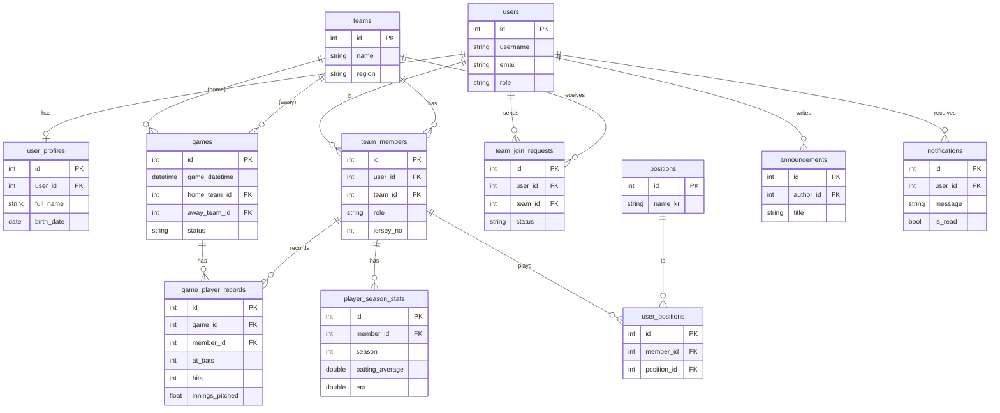

# 데이터베이스 스키마 변경 제안 (v2)

이 문서는 프론트엔드 기능 구현과 확장성을 고려하여 현재 백엔드 데이터베이스 스키마에 필요한 변경 및 추가 사항을 제안합니다. v1에서 제안된 내용에 다이어그램과 테이블 명세를 추가했습니다.

## 1. 제안된 DB 스키마 다이어그램 (ERD)

아래 다이어그램은 기존 엔티티와 신규 제안 엔티티를 포함한 전체 데이터베이스 구조를 보여줍니다.



## 2. 테이블 명세

### 2.1. 사용자 관련
- **users**: 사용자 계정의 핵심 정보 (로그인 ID, 비밀번호, 시스템 역할 등)
- **user_profiles**: 사용자의 상세 프로필 (실명, 생년월일, 연락처 등)
- **team_members (제안)**: 사용자가 특정 팀에 소속된 정보 (팀 역할, 등번호 등). 기존 `user_baseball`을 대체 및 확장합니다.
- **positions**: '투수', '포수' 등 포지션 마스터 데이터
- **user_positions**: 특정 팀 멤버가 맡은 포지션 정보

### 2.2. 팀 관련
- **teams**: 팀의 고유 정보 (팀명, 연고지, 리그 등)
- **team_join_requests (제안)**: 사용자의 팀 가입 신청 정보 및 상태
- `team_info`, `team_contacts` 등 기존 상세 정보 테이블은 그대로 유지됩니다.

### 2.3. 경기 및 기록 관련
- **games (제안)**: 경기 일정, 장소, 참여 팀, 최종 점수 등 경기 기본 정보
- **game_player_records (제안)**: 특정 경기에 참여한 선수의 상세 기록 (타격, 투구 등)
- **player_season_stats (제안)**: 선수별 시즌 통계를 저장하여 순위(leaderboard) 조회 시 성능을 확보하기 위한 테이블

### 2.4. 커뮤니티 관련
- **announcements**: 기존 `notices` 테이블. 공지사항 정보를 저장합니다.
- **notifications (제안)**: 사용자에게 발송된 알림의 내용, 상태, 연결 링크 등을 저장합니다.

## 3. 신규 엔티티(테이블) 추가 제안 (상세)

*기존 제안 내용과 동일합니다.*

### 3.1. 경기(Game) 및 관련 엔티티

#### `Game.java` (경기 정보)
```java
package io.github.ruifoot.infrastructure.persistence.entity.game;

// ... (이전 제안과 동일한 코드)
```

#### `GamePlayerRecord.java` (경기별 선수 기록)
```java
package io.github.ruifoot.infrastructure.persistence.entity.game;

// ... (이전 제안과 동일한 코드)
```

### 3.2. 팀 관리 강화 엔티티

#### `TeamMember.java` (팀 멤버 정보)
```java
package io.github.ruifoot.infrastructure.persistence.entity.team;

// ... (이전 제안과 동일한 코드)
```

#### `TeamJoinRequest.java` (팀 가입 신청)
```java
package io.github.ruifoot.infrastructure.persistence.entity.team;

// ... (이전 제안과 동일한 코드)
```

### 3.3. 알림(Notification) 엔티티

#### `Notification.java`
```java
package io.github.ruifoot.infrastructure.persistence.entity.notification;

// ... (이전 제안과 동일한 코드)
```

## 4. 통계 데이터 관리 방안

### `PlayerSeasonStats.java` (선수 시즌 통계)
```java
package io.github.ruifoot.infrastructure.persistence.entity.stats;

// ... (이전 제안과 동일한 코드)
```