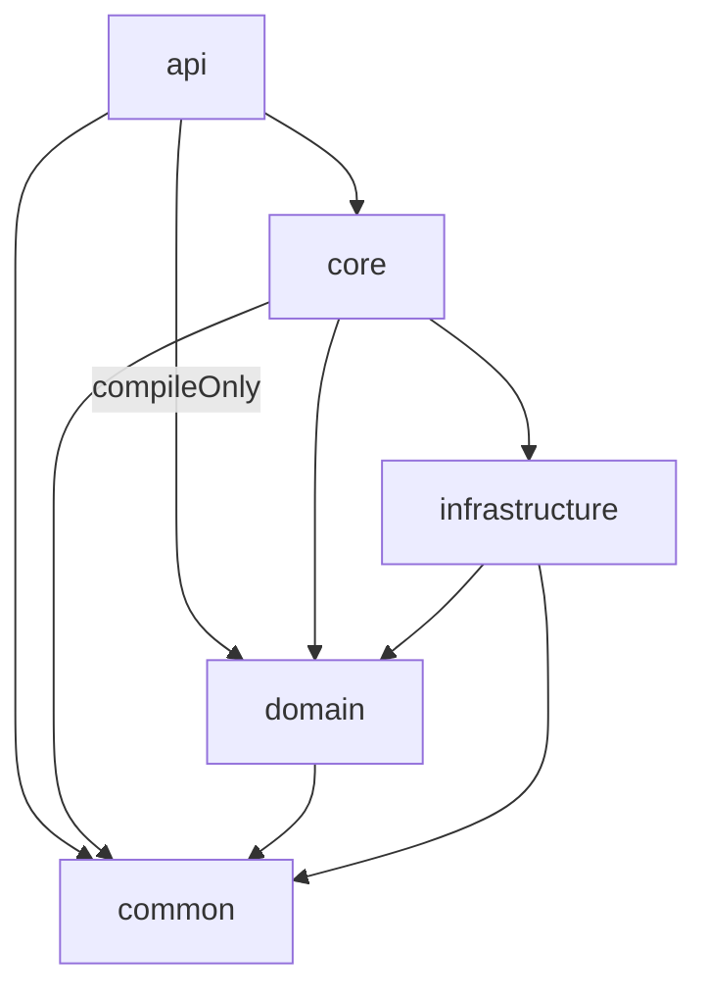

# 사회인 야구 팀 플랫폼 API

이 프로젝트는 사회인 야구 팀을 위한 플랫폼 API를 제공합니다. 팀 관리, 선수 관리, 경기 일정, 기록 등 다양한 기능을 RESTful API로 제공하여 사회인 야구 활동을 지원합니다.

## ⚾️ 프로젝트 구조

본 프로젝트는 DDD(Domain-Driven Design) 원칙을 일부 적용한 계층형 아키텍처를 따르며, 각 모듈은 독립적인 역할을 수행합니다.

```
Baseball-Project/
├── api              # API 엔드포인트 및 컨트롤러
├── common           # 여러 모듈에서 공통으로 사용하는 유틸리티, DTO, 예외 처리
├── core             # 핵심 비즈니스 로직 구현
├── domain           # 도메인 모델, 서비스 및 리포지토리 인터페이스 정의
└── infrastructure   # 데이터베이스, 보안, 외부 서비스 연동 등 기술적 구현
```

### 모듈 의존성



- **api**: 외부 요청을 받는 API 엔드포인트를 정의합니다. `core` 모듈의 비즈니스 로직을 호출하고, `common`의 DTO를 사용하며, `domain`의 모델을 컴파일 시점에만 참조합니다.
- **core**: `domain`의 인터페이스를 구현하는 핵심 비즈니스 로직을 포함합니다. 데이터 처리를 위해 `infrastructure` 모듈을 사용합니다.
- **domain**: 순수한 비즈니스 모델과 로직의 규칙(인터페이스)을 정의합니다. `common` 외에 다른 모듈에 의존하지 않습니다.
- **infrastructure**: `domain`의 리포지토리 인터페이스를 구현하고, 데이터베이스 연동, 보안 설정 등 기술적인 부분을 담당합니다.
- **common**: 모든 모듈에서 공유되는 공통 코드(DTO, 예외 클래스 등)를 포함합니다.

## 🛠️ 기술 스택

- **언어**: Java 24
- **프레임워크**: Spring Boot 3.4.5
- **데이터베이스**: JPA, PostgreSQL, MySQL, H2 (테스트용)
- **보안**: Spring Security, JWT
- **캐싱**: Redis
- **API 문서화**: SpringDoc OpenAPI (Swagger UI)
- **빌드 도구**: Gradle
- **기타**: Lombok, Dotenv

## 🚀 시작하기

### 필수 조건

- Java 24
- Gradle
- Docker (PostgreSQL, Redis 실행용) 또는 로컬 설치

### 설치 및 실행

1.  **저장소 클론**
    ```bash
    git clone https://github.com/ruifoot/Baseball-Project.git
    cd Baseball-Project
    ```

2.  **환경 변수 설정**
    `api` 모듈과 `infrastructure` 모듈의 `src/main/resources` 경로에 `.env` 파일을 생성하고 필요한 환경 변수를 설정합니다. (`.env.example` 파일을 참고하세요.)

    **`api/.env` 예시:**
    ```
    # API 서버 포트
    SERVER_PORT=8080
    ```

    **`infrastructure/.env` 예시:**
    ```
    # 데이터베이스 연결 정보
    DB_URL=jdbc:postgresql://localhost:5432/baseball
    DB_USERNAME=user
    DB_PASSWORD=password

    # JWT 비밀 키
    JWT_SECRET=your-very-secret-and-long-jwt-key

    # Redis 연결 정보
    REDIS_HOST=localhost
    REDIS_PORT=6379
    ```

3.  **빌드 및 실행**
    ```bash
    # 전체 프로젝트 빌드
    ./gradlew clean build

    # API 애플리케이션 실행
    ./gradlew :api:bootRun
    ```

4.  **API 문서 확인**
    애플리케이션 실행 후, 아래 URL에서 API 문서를 확인할 수 있습니다.
    `http://localhost:8080/swagger-ui.html`

## 📝 API 엔드포인트

주요 API 엔드포인트는 다음과 같습니다. 전체 목록은 실행 후 Swagger UI를 참고해주세요.

- **인증 API (`/auth`)**: 회원가입, 로그인, 로그아웃, 토큰 갱신
- **사용자 API (`/users`)**: 사용자 정보 조회 및 수정
- **팀 API (`/teams`)**: 팀 생성, 조회, 수정, 삭제
- **선수 API (`/players`)**: 선수 등록, 정보 수정

## 🌐 응답 형식

모든 API 응답은 아래와 같은 표준 형식을 따릅니다.

```json
{
  "status": 200,
  "message": "요청 성공",
  "data": {
    "id": 1,
    "name": "루이풋 야구단"
  }
}
```

## 🛡️ 예외 처리

공통 예외 처리 핸들러를 통해 상황에 맞는 HTTP 상태 코드와 메시지를 반환합니다.

- `400 Bad Request`: 잘못된 요청 (입력값 오류 등)
- `401 Unauthorized`: 인증 실패
- `403 Forbidden`: 접근 권한 없음
- `404 Not Found`: 리소스를 찾을 수 없음
- `409 Conflict`: 리소스 충돌 (중복된 값 등)
- `500 Internal Server Error`: 서버 내부 오류